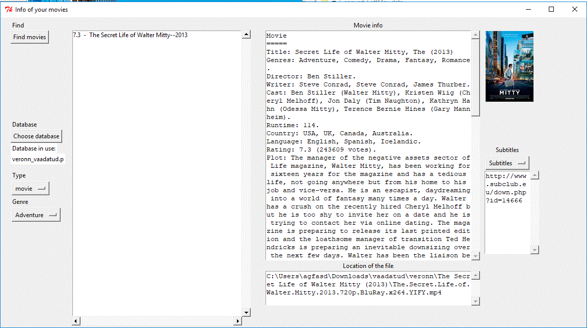

# Info_of_your_movies
GUI to download IMDB information and browse of your movies.

Main features:

1)Finds video files (movies, TV series) from a given folder

2)Guesses the name of movies/TV series and downloads data form IMDB

3)Checks existence of subtitles at http://www.subclub.eu

4)Allows to browse movies by genre and IMDB score

## Requirements
1) Python 3+
   and libraries: (guessit, IMDbPY)
 
    or

2) you can run also provided stand-alone executable without any prerequisites (single portable exe-file which works out of the box).
  
    Currently provided:
  
    [convert_SoftMax_data3_win8+.exe](https://github.com/luidale/convert_SoftMax_data/blob/master/convert_SoftMax_data3_win8+.exe)   - works at least in Windows 10 and Windows 8 (other OS-s not tested).

TO DO:

1)Options to correct names
2)During movie search have active window open
3)During search the movie names run on the active window only

Licence
-------
[GNU General Public License v3.0 ](https://github.com/luidale/Info_of_your_movies/blob/master/LICENSE)

Authors
-------
[Info_of_your_movies](https://github.com/luidale/Info_of_your_movies) was written by [Hannes Luidalepp](luidale@gmail.com)

